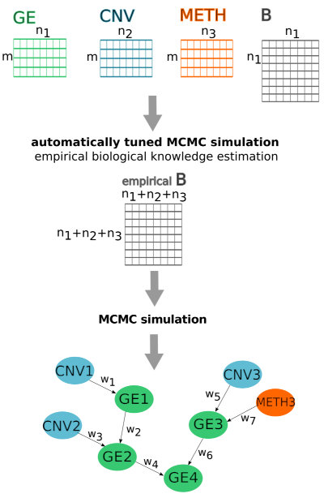

# IntOMICS: an R package for integrative analysis of multi-omics data to infer regulatory networks.

IntOMICS is an efficient integrative framework based on Bayesian networks.
IntOMICS systematically analyses gene expression, DNA methylation, copy number variation and biological prior knowledge to infer regulatory networks. 
IntOMICS complements the missing biological prior knowledge by so-called empirical biological knowledge, estimated from the available experimental data. 
An automatically tuned MCMC algorithm ([Yang and Rosenthal, 2017](http://probability.ca/jeff/ftpdir/jinyoung1.pdf)) estimates model parameters and the empirical biological knowledge.
Conventional MCMC algorithm with additional Markov blanket resampling step ([Su and Borsuk, 2016](https://jmlr.org/papers/volume17/su16a/su16a.pdf)) infers resulting regulatory network structure consisting of three types of nodes: GE nodes refer to gene expression levels, CNV nodes refer to associated copy number variations, and METH nodes refer to associated DNA methylation probe(s).
Regulatory networks derived from IntOMICS provide deeper insights into the complex flow of genetic information. 
IntOMICS is a powerful resource for exploratory systems biology and can provide valuable insights into the complex mechanisms of biological processes 
that has a vital role in personalised medicine.

IntOMICS takes as input (i) gene expression matrix GE with m samples and n1 genes, (ii) associated copy number variation matrix CNV (m x n2), 
(iii) associated DNA methylation matrix of beta-values METH (m x n3) sampled from the same individuals, and (iv) the biological prior knowledge 
with information on known interactions among molecular features. 
An automatically tuned MCMC algorithm (Yang and Rosenthal, 2009) estimates parameters and empirical biological knowledge. 
Conventional MCMC algorithm with additional Markov blanket resampling step (Su and Borsuk, 2016) is used to infer resulting regulatory network structure 
consisting of three types of nodes: GE nodes refer to gene expression levels, CNV nodes refer to copy number variations, and METH nodes refer to DNA methylation. 
The resulting regulatory network structure contains the edge weights $w_i$ representing the empirical frequency of given edge over samples of network structures from two independent MCMC simulations.

  

     
For further details, see manuscript [Pacinkova \& Popovici, 2022](https://assets.researchsquare.com/files/rs-1291540/v1_covered.pdf?c=1643735189). 

# Installation

<pre><code>
install_github("anna-pacinkova/intomics_package")  
library(devtools)
</code></pre>

# Usage

This tutorial will show you how to use the IntOMICS package with a toy example.
The example dataset is from [the TCGA data portal](https://portal.gdc.cancer.gov/): 30 colon cancer samples (COAD) with microsatellite instability (MSI).
We choose the set of 7 genes from the [KEGG Colorectal cancer pathway](https://www.genome.jp/pathway/hsa05210).

## Part 1: Input data
<pre><code>
library(knitr)
library(IntOMICS)
library(bestNormalize)
library(foreach)
library(bnlearn)
library(RColorBrewer)
library(png) 
library(matrixStats)
suppressMessages(library(igraph))
suppressMessages(library(ggraph))
suppressMessages(library(bnstruct))
</code></pre>

IntOMICS framework takes as input:  
  
* gene expression matrix $GE$ ($m$ x $n_1$) with microarray intensities or RNA-seq count data transformed into a continuous domain ($m$ samples and $n_1$ features)
  
* associated copy number variation matrix $CNV$ ($m$ x $n_2$) with continuous segment mean values derived for each gene ($m$ samples and $n_2$ features, $n_2 \leq n_1$),
  
* associated DNA methylation matrix of beta-values $METH$ ($m$ samples and $n_3$ features, $m$ x $n_3$),
  
* data.frame including all known interactions between molecular features (information from public available databases such as KEGG ([Ogata et al., 1999](https://academic.oup.com/nar/article/27/1/29/1238108?login=true)) or REACTOME ([Wu \& Haw, 2017](https://link.springer.com/protocol/10.1007/978-1-4939-6783-4_11))). However, any other source of prior knowledge can be used.  
  
All data matrices are sampled from the same individuals.  

Available omics data in the example TCGA COAD MSI dataset are gene expression (GE) of 7 genes + copy number variation (CNV) of 7 genes + beta value of 115 DNA methylation (METH) probes:

<pre><code>
omics$ge[1:5,1:5]
</code></pre>

cardinals

These values correspond to normalised RNA-seq data. 
However, the user is not limited to this platform. Another assay, such as microarray data, can be used. The column names of omics$ge matrix must be entrez ID in the format ENTREZID:XXXX.

<pre><code>
omics$cnv[1:5,1:5]
</code></pre>

These copy number values represent segment mean values equal to $log_2(\frac{copy-number}{2})$.
The column names of omics\$cnv matrix must be entrez ID in the format entrezid:XXXX.
In the omics$cnv matrix, define only columns with available CNV data.

<pre><code>
omics$meth[1:5,1:5]
</code></pre>

These values represent DNA methylation beta values. The column names of the omics$meth matrix are probe IDs.  

IntOMICS is designed to infer regulatory networks even if the copy number variation or DNA methylation data (or both) are not available.  

If methylation data are available, we have to provide an annotation:

<pre><code>
str(annot)
</code></pre>

annot is a named list. Each component of the list is a character vector and corresponds to probe IDs associated with a given gene. Names of the annot must be again in the format ENTREZID:XXXX.  

To generate comprehensive figures with gene IDs, we need to provide a gene annotation table:
<pre><code>
gene_annot
</code></pre>

gene_annot is Gene ID conversion table with "entrezID" and "gene_symbol" column names. Gene symbols are used for the final regulatory network visualisation.  

And finally, the prior knowledge from any source chosen by the user:
<pre><code>
PK
</code></pre>

PK is the data.frame with biological prior knowledge. Column names are "src_entrez" (the parent node), "dest_entrez" (the child node) and "edge_type" (the prior knowledge about the direct interaction between parent and child node; the allowed values are "present" or "missing").

## Part 2: Data preprocessing

The first step is to define the biological prior matrix and estimate the upper bound of the partition function needed to define the prior distribution of network structures.
We also need to define all possible parent set configurations for each node.  For each parent set configuration, we compute the energy (needed to define the prior distribution of network structures) and the BGe score (needed to determine the posterior probability of network structures).
These functionalities are available through the \texttt{OMICS\_module()} function.  
We can use linear regression to filter irrelevant DNA methylation probes. We set the parameter lm_METH = TRUE (default lm_METH = TRUE).
We can also specify the threshold for the R^2 to choose DNA methylation probes with significant coefficient using the r_squared_thres (default = 0.3).
<pre><code>
OMICS_module_res <- OMICS_module(omics = omics, PK = PK, layers_def = layers_def, annot = annot, r_squared_thres = 0.3, lm_METH = TRUE)
</code></pre>

These DNA methylation probes passed the filter:
<pre><code>
OMICS_module_res$annot
</code></pre>

## Part 3: MCMC simulation

Now, we can use the automatically tuned MCMC algorithm (Yang and Rosenthal, 2017) to estimate model parameters and empirical biological knowledge and the conventional MCMC algorithm with additional Markov blanket resampling step (Su and Borsuk, 2016) to infer regulatory network structure consisting of three types of nodes: GE, CNV and METH nodes. 
This step can be time-consuming (you can skip it and use the pre-computed result -> R object BN_module_res).
<pre><code>
BN_module_res <- BN_module(burn_in = 100000, 
                           thin = 500, 
                           seed1 = 1001,
                           seed2 = 2002,
                           OMICS_module_res = OMICS_module_res,
                           minseglen = 50000)
</code></pre>

## Part 4: MCMC diagnostics

Now we have to create a directory to store trace plots. 
Once it is created, we can run the trace_plots function, which generates:  
  
1. beta_values.svg: trace plot of beta values (we want to explore the sample space many times and avoid flat bits - the chain stays in the same state for too long)  
  
2. post_prob_edges.svg: consistency of edges posterior probabilities in two independent MCMC simulations (scatter plot of the edge weights confidence using two independent MCMC runs; the convergence is determined by the spread of the points around the y=x line)   
  
3. convergence_RMS.svg: the c_{rms} strength for the convergence evaluation (summarizes the spread of the points around the line y=x in post_prob_edges.svg, for details see (Agostinho et al., 2015 and Pacinkova \& Popovici, 2022)).  
  
The parameter edge_freq_thres determines the quantile of all edge weights used to filter only reliable edges.
The parameter gene_ID determines the IDs used in the final network. There are two options: 'gene_symbol' (default) or 'entrezID'.
<pre><code>
res_weighted <- trace_plots(mcmc_res = BN_module_res, figures_dir = "figures/MSI/", burn_in = 100000, thin = 500, gene_annot = gene_annot, PK = PK, OMICS_module_res = OMICS_module_res, gene_ID = "gene_symbol", edge_freq_thres = 0.75)
</code></pre>

## Part 5: IntOMICS resulting network structure

<pre><code>
ggraph(res_weighted$net_weighted, layout = 'dh') + 
  geom_edge_link(aes(end_cap = circle(node2.degree + 7, "pt"), edge_color = edge, label = weight),
                 arrow = arrow(angle = 20, length = unit(0.1, "inches"),
                              ends = "last", type = "closed"))+
  geom_node_point(aes(color = factor(color)), size = 10) +
  scale_colour_manual(values = res_weighted$node_palette, guide = "none")+
  geom_node_text(aes(label = label),family="serif")
</code></pre>

Edges highlighted in green are known from the biological prior knowledge. 
GE node names are in upper case, CNV node names are in lower case, METH node names are the same as DNA methylation probe names in omics$meth matrix.  

Node colours legend:
<pre><code>
legend_custom(net = res_weighted)
</code></pre>
  
Node colour scales are given by GE/CNV/METH values of all features from the corresponding input data matrix.  

If you find a bug or have a comment let us know, please, via an e-mail: ana.pacinkova@gmail.com

